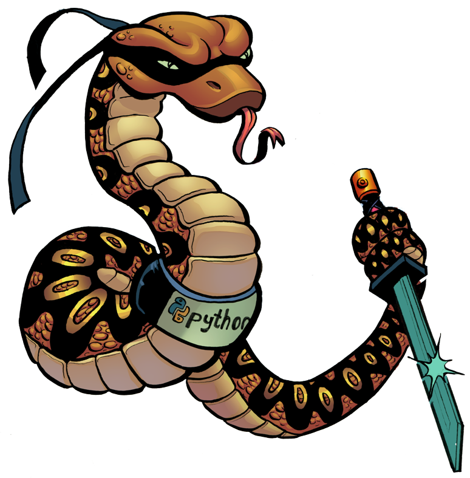

# Python: Unleashing Your Inner Python Ninja 🐍

    

Welcome to the GitHub repository for "Mastering Python Excellence: Unleashing Your Inner Python Ninja." This guide is crafted to enhance your Python skills, turning you into a skilled Python Ninja. Whether you're an experienced developer or just beginning with Python, this repository is your ultimate resource for mastering the art of Python programming. Inside, you'll discover a carefully curated collection of in-depth tutorials, practical examples, and hands-on exercises covering a broad spectrum of Python topics. From fundamental concepts to advanced techniques, each section is designed to equip you with the knowledge and skills necessary to navigate the Python landscape like a true ninja. Embark on this journey to Python mastery, uncovering the secrets that will unleash your potential as a developer. Let's delve in and harness the power of your inner Python Ninja!

This repository is designed to help refresh your Python skills by offering a comprehensive and step-by-step introduction to the Python programming language. Starting with the basics, the repository covers essential and advanced concepts required for programming in Python. Each section is structured in a clear and easily understandable manner, enabling learners to make progress quickly.

In addition to gaining a solid understanding of Python programming, learners will also gain insights into proven techniques and methods that can be applied to other programming languages. This repository also offers opportunities to improve skills through knowledge exchange and discussions within the community. So, whether you're a beginner or a seasoned programmer, this repository is an excellent resource to refresh and improve your Python skills.

1. [Python Basics 📚](./01_Python_Basics/README.md)
2. [Control Flow 🔄](#control-flow-)
3. [Functions 🎯](#functions-)
4. [Errors ❌](#errors-)
5. [Modules 📦](#modules-)
6. [Lists 📋](#lists-)
7. [OOP 🏗️](#oop-)
8. [Built-in Functions 🛠️](#built-in-functions-)
9. [Dataclasses 📇](#dataclasses-)
10. [AsyncIO ⚙️](#asyncio-)
11. [Advanced 🚀](#advanced-)
12. [Multithreading](#multithreading-) 🔄
13. [Multiprocessing](#multiprocessing-) ⚙️
14. [Unit-Testing](#unit-testing-) 🛠️
15. [File-Management](#file-management-) 📂
16. [Design Patterns](#design-patterns-) 🎨

## Python Basics 📚

- [Syntax](01_Python_Basics/01_Syntax/README.md) [👨‍💻](01_Python_Basics\01_Syntax\code)
- [Comments](01_Python_Basics/02_Comments/README.md) [👨‍💻](.\01_Python_Basics\02_Comments\code)
- [Variables](01_Python_Basics/03_Variables/README.md) [👨‍💻](#)
- [Constants](01_Python_Basics/04_Constants/README.md) [👨‍💻](#)
- [Data_Types](01_Python_Basics/05_Data_Types/README.md) [👨‍💻](#)
- [Type_Hints](01_Python_Basics/06_Type_Hints/README.md) [👨‍💻](#)
- [Shortcut_Format](01_Python_Basics/07_Shortcut_Format/README.md) [👨‍💻](#)
- [Integers](01_Python_Basics/08_Integers/README.md) [👨‍💻](#)
- [Floats](01_Python_Basics/09_Floats/README.md) [👨‍💻](#)
- [Operators](01_Python_Basics/10_Operators/README.md) [👨‍💻](#)
- [Strings](01_Python_Basics/11_Strings/README.md) [👨‍💻](#)
- [Type_Conversion](01_Python_Basics/12_Type_Conversion/README.md) [👨‍💻](#)
- [Simple_Adder_Project](01_Python_Basics/13_Simple_Adder_Project/README.md) [👨‍💻](#)
- [Booleans](01_Python_Basics/14_Booleans/README.md) [👨‍💻](#)
- [Lists](01_Python_Basics/15_Lists/README.md) [👨‍💻](#)
- [Tuples](01_Python_Basics/16_Tuples/README.md) [👨‍💻](#)
- [Sets](01_Python_Basics/17_Sets/README.md) [👨‍💻](#)
- [Frozensets](01_Python_Basics/18_Frozensets/README.md) [👨‍💻](#)
- [Dictionaries](01_Python_Basics/19_Dictionaries/README.md) [👨‍💻](#)
- [None](01_Python_Basics/20_None/README.md) [👨‍💻](#)
- [Mad_Libs_Project](01_Python_Basics/21_Mad_Libs_Project/README.md) [👨‍💻](#)
- [Truthy_and_Falsy](01_Python_Basics/22_Truthy_and_Falsy/README.md) [👨‍💻](#)
- [Comparing_Floats](01_Python_Basics/23_Comparing_Floats/README.md) [👨‍💻](#)
- [Scopes](01_Python_Basics/24_Scopes/README.md) [👨‍💻](#)
- [Global](01_Python_Basics/25_Global/README.md) [👨‍💻](#)
- [Nonlocal](01_Python_Basics/26_Nonlocal/README.md) [👨‍💻](#)
- [Doc_Strings](01_Python_Basics/27_Doc_Strings/README.md) [👨‍💻](#)
- [F-Strings](01_Python_Basics/28_F-Strings/README.md) [👨‍💻](#)
- [Assertions](01_Python_Basics/29_Assertions/README.md) [👨‍💻](#)
- [Unpacking](01_Python_Basics/30_Unpacking/README.md) [👨‍💻](#)
- [__ VS __ == Is](01_Python_Basics/31_VS_Is/README.md) [👨‍💻](#)

## Control Flow 🔄

- [If_Elif_Else](02_Control_Flow/01_If_Elif_Else/README.md) [👨‍💻](#)
- [If_Else_Shorthand](02_Control_Flow/02_If_Else_Shorthand/README.md) [👨‍💻](#)
- [For_Loop](02_Control_Flow/03_For_Loop/README.md) [👨‍💻](#)
- [While_Loop](02_Control_Flow/04_While_Loop/README.md) [👨‍💻](#)
- [Break_and_Continue](02_Control_Flow/05_Break_and_Continue/README.md) [👨‍💻](#)
- [Loop-Else](02_Control_Flow/06_Loop-Else/README.md) [👨‍💻](#)
- [Rock_Paper_Scissors](02_Control_Flow/07_Rock_Paper_Scissors/README.md) [👨‍💻](#)

## Functions 🎯

- [Creating_a_Function](03_Functions/01_Creating_a_Function/README.md) [👨‍💻](#)
- [Pass](03_Functions/02_Pass/README.md) [👨‍💻](#)
- [Parameters_and_Arguments](03_Functions/03_Parameters_and_Arguments/README.md) [👨‍💻](#)
- [Return_Functions](03_Functions/04_Return_Functions/README.md) [👨‍💻](#)
- [Recursion](03_Functions/05_Recursion/README.md) [👨‍💻](#)
- [Args_and_Kwargs](03_Functions/06_Args_and_Kwargs/README.md) [👨‍💻](#)
- [Star_and_Slash](03_Functions/07_Star_and_Slash/README.md) [👨‍💻](#)
- [Chat_Bot](03_Functions/08_Chat_Bot/README.md) [👨‍💻](#)

## Errors ❌

- [User Input](04_Errors/01_User_Input/README.md) [👨‍💻](#)
- [Shortcut](04_Errors/02_Shortcut/README.md) [👨‍💻](#)
- [Try &amp; Except](04_Errors/03_Try_Except/README.md) [👨‍💻](#)
- [Else Finally](04_Errors/04_Else_Finally/README.md) [👨‍💻](#)
- [Raise](04_Errors/05_Raise/README.md) [👨‍💻](#)
- [Unknown Errors](04_Errors/06_Unknown_Errors/README.md) [👨‍💻](#)
- [Letters Only](04_Errors/07_Letters_Only/README.md) [👨‍💻](#)

## Modules 📦

- [Modules](05_Modules/01_Modules/README.md) [👨‍💻](#)
- [Importing](05_Modules/02_Importing/README.md) [👨‍💻](#)
- [if_name_main](05_Modules/03_if_name_main/README.md) [👨‍💻](#)
- [Packages](05_Modules/04_Packages/README.md) [👨‍💻](#)
- [Libraries](05_Modules/05_Libraries/README.md) [👨‍💻](#)
- [Website_Status](05_Modules/06_Website_Status/README.md) [👨‍💻](#)

## Lists 📋

- [List_Comprehensions](06_Lists/01_List_Comprehensions/README.md) [👨‍💻](#)
- [Slicing](06_Lists/02_Slicing/README.md) [👨‍💻](#)
- [Dont_Loop_Modify](06_Lists/03_Dont_Loop_Modify/README.md) [👨‍💻](#)
- [Grocery_List](06_Lists/04_Grocery_List/README.md) [👨‍💻](#)

## OOP 🏗️

- [OOP](07_OOP/01_OOP/README.md) [👨‍💻](#)
- [Classes_and_Objects](07_OOP/02_Classes_and_Objects/README.md) [👨‍💻](#)
- [init](07_OOP/03_init/README.md) [👨‍💻](#)
- [self](07_OOP/04_self/README.md) [👨‍💻](#)
- [Attributes_Class_and_Instance](07_OOP/05_Attributes_Class_and_Instance/README.md) [👨‍💻](#)
- [Dunder_Methods](07_OOP/06_Dunder_Methods/README.md) [👨‍💻](#)
- [str()_repr()](07_OOP/07_str()_repr()/README.md) [👨‍💻](#)
- [eq()](07_OOP/08_eq()/README.md) [👨‍💻](#)
- [Methods_Functions](07_OOP/09_Methods_Functions/README.md) [👨‍💻](#)
- [Chat_Bot](07_OOP/10_Chat_Bot/README.md) [👨‍💻](#)
- [Inheritance](07_OOP/11_Inheritance/README.md) [👨‍💻](#)
- [super()](07_OOP/12_super()/README.md) [👨‍💻](#)
- [@staticmethod](07_OOP/13_@staticmethod/README.md) [👨‍💻](#)
- [@classmethod](07_OOP/14_@classmethod/README.md) [👨‍💻](#)
- [@abstractmethod](07_OOP/15_@abstractmethod/README.md) [👨‍💻](#)
- [Name_Mangling](07_OOP/16_Name_Mangling/README.md) [👨‍💻](#)

## Built in Functions 🛠️

- [print()](08_Built_in_Functions/01_print()/README.md) [👨‍💻](#)
- [enumerate()](08_Built_in_Functions/02_enumerate()/README.md) [👨‍💻](#)
- [round()](08_Built_in_Functions/03_round()/README.md) [👨‍💻](#)
- [range()](08_Built_in_Functions/04_range()/README.md) [👨‍💻](#)
- [slice()](08_Built_in_Functions/05_slice()/README.md) [👨‍💻](#)
- [globals()](08_Built_in_Functions/06_globals()/README.md) [👨‍💻](#)
- [locals()](08_Built_in_Functions/07_locals()/README.md) [👨‍💻](#)
- [all()](08_Built_in_Functions/08_all()/README.md) [👨‍💻](#)
- [any()](08_Built_in_Functions/09_any()/README.md) [👨‍💻](#)
- [isinstance()](08_Built_in_Functions/10_isinstance()/README.md) [👨‍💻](#)
- [Improved_Chat_Bot](08_Built_in_Functions/11_Improved_Chat_Bot/README.md) [👨‍💻](#)
- [callable()](08_Built_in_Functions/12_callable()/README.md) [👨‍💻](#)
- [filter()](08_Built_in_Functions/13_filter()/README.md) [👨‍💻](#)
- [map()](08_Built_in_Functions/14_map()/README.md) [👨‍💻](#)
- [sorted()](08_Built_in_Functions/15_sorted()/README.md) [👨‍💻](#)
- [eval()](08_Built_in_Functions/16_eval()/README.md) [👨‍💻](#)
- [exec()](08_Built_in_Functions/17_exec()/README.md) [👨‍💻](#)
- [zip()](08_Built_in_Functions/18_zip()/README.md) [👨‍💻](#)

## Dataclasses 📇

- [@dataclass](09_Dataclasses/01_@dataclass/README.md) [👨‍💻](#)
- [Fields](09_Dataclasses/02_Fields/README.md) [👨‍💻](#)
- [post_init](09_Dataclasses/03_post_init/README.md) [👨‍💻](#)
- [InitVar](09_Dataclasses/04_InitVar/README.md) [👨‍💻](#)
- [@property](09_Dataclasses/05_@property/README.md) [👨‍💻](#)
- [Notes](09_Dataclasses/06_Notes/README.md) [👨‍💻](#)

## AsyncIO ⚙️

- [Intro](10_AsyncIO/01_Intro/README.md) [👨‍💻](#)
- [Getting_Started](10_AsyncIO/02_Getting_Started/README.md) [👨‍💻](#)
- [Tasks](10_AsyncIO/03_Tasks/README.md) [👨‍💻](#)
- [Gather](10_AsyncIO/04_Gather/README.md) [👨‍💻](#)
- [Website_Status](10_AsyncIO/05_Website_Status/README.md) [👨‍💻](#)

## Advanced 🚀

- [Mypy](11_Advanced/01_Mypy/README.md) [👨‍💻](#)
- [Walrus_Operator](11_Advanced/02_Walrus_Operator/README.md) [👨‍💻](#)
- [Lambda_Functions](11_Advanced/03_Lambda_Functions/README.md) [👨‍💻](#)
- [Generators](11_Advanced/04_Generators/README.md) [👨‍💻](#)

## AsyncIO

- Tasks
- Gather

## Multithreading

- Threads
- Locks
- Daemon-Threads
- Semaphores
- With Lock Semaphore
- Race Conditions

## Multiprocessing

- Processes
- Pools Map

## Unit-Testing

- Fixtures
- Conftest
- Marks
- Parametrize
- Testing Errors

## File-Management

## Design Patterns
